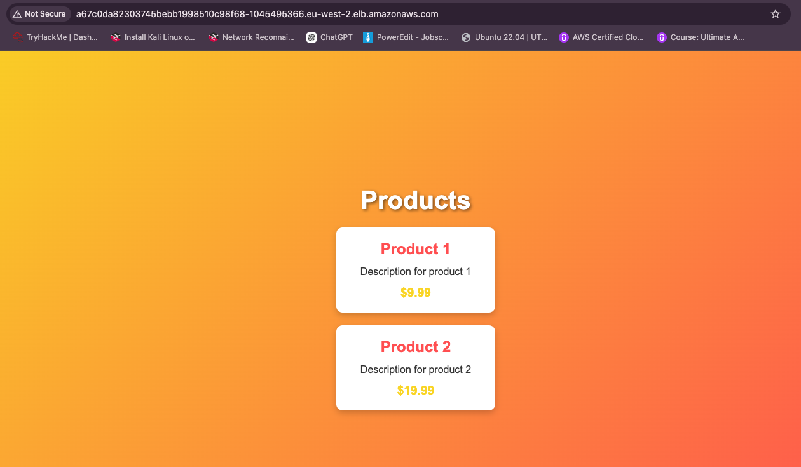

# k8s-training
Project structure: <br>
```
k8s-training/ <br>
├── nginx/ <br>
│   └── nginx.conf <br>
├── frontend/ <br>
│   ├── index.html <br>
│   ├── styles.css <br>
│   ├── Dockerfile <br>
│   └── script.js <br>
├── backend/ <br>
│   ├── server.json <br>
│   └── Dockerfile <br>
├── k8s/ <br>
│   ├── nginx-deployment.yml (containing both deployment and service for frontend ) <br>
│   ├── backend-deployment.yml (containing both deployment and service for backend) <br>
│   ├── ingress.yml <br>
│   ├── namespace.yml <br>
│   └── kustomization.yml <br>
├── docker-compose.yml/ <br>
└── README.md <br>
```
## After configuring the Dockerfiles and the nginx.conf files
* In order to build & push my docker images in both architectures I run: <br>
`docker buildx build --platform linux/amd64,linux/arm64 -t tassianna/k8s-training:frontend -f frontend/Dockerfile --push .` <br>
`docker buildx build --platform linux/amd64,linux/arm64 -t tassianna/k8s-training:backend -f backend/Dockerfile --push .` <br>
* Run docker `compose up --build` for locally testing the app

> The -f flag allows me to build my docker image on my root folder.
> The --push flags push my images in my DockerHub directly.

## Switching to eks cluster
`aws eks update-kubeconfig --region <region-code> --name <my-cluster>` <br>

## After switching to eks cluster
* Make sure that the ingress controller is installed:   <br>
`curl https://raw.githubusercontent.com/helm/helm/master/scripts/get-helm-3 > get_helm.sh` <br>
`chmod 700 get_helm.sh` <br>
`helm repo add ingress-nginx https://kubernetes.github.io/ingress-nginx` <br>
`helm repo update` <br>
`helm upgrade --install ingress-nginx ingress-nginx/ingress-nginx \` <br>
  `--namespace ingress-nginx \` <br>
 ` --create-namespace` <br>
* Check if the controller is correctly installed:  <br>
`kubectl get ns` <br>

## Apply k8s manifest files to my eks
* Run the following commands:
`cd /k8s             # change to the kubernetes folder` <br>
`kubectl apply -k .  # and apply the kustomization file containing all the manifest resources` <br>
`kubectl get services -o wide --namespace frontend-ns` <br>
* You should get something like this:
`web-loadbalancer   LoadBalancer   xxx.xxx.xxx.xxx   xxxxxxxx.eu-west-2.elb.amazonaws.com    80:30000/TCP   10m    app=web` <br>
* Frontend is available here: http://a67c0da82303745bebb1998510c98f68-1045495366.eu-west-2.elb.amazonaws.com/
* And the backend API: http://a67c0da82303745bebb1998510c98f68-1045495366.eu-west-2.elb.amazonaws.com/api/products


